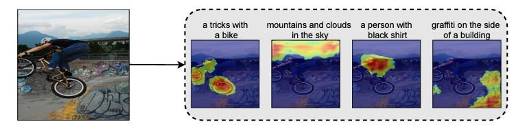
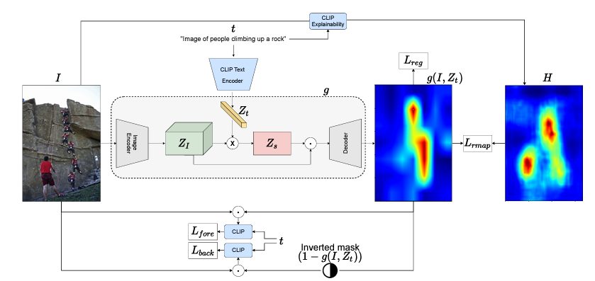
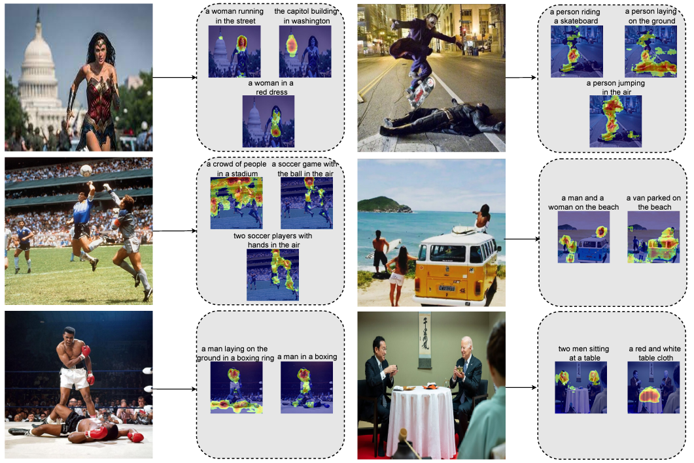
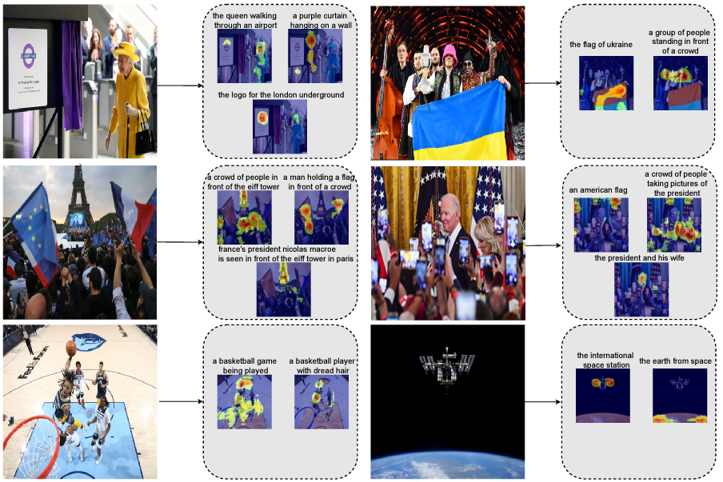

# What is Where by Looking: Weakly-Supervised Open-World Phrase-Grounding without Text Inputs
<p align="center">
  
</p>

- Paper : [link](https://arxiv.org/abs/2206.09358)

- Demo : [link](https://replicate.com/talshaharabany/what-is-where-by-looking)

<p align="center">
  
</p>

### Get Started
- datasets format are followed by [link](https://github.com/hassanhub/MultiGrounding/tree/master/data)

**For training a model :**
```
python train_grounding.py -bs 32 -nW 8 -nW_eval 1 -task vg_train -data_path /path_to/vg -val_path /path_to/flicker
python train_grounding.py -bs 32 -nW 8 -nW_eval 1 -task coco -data_path /path_to/coco -val_path /path_to/flicker
```

**For Grounding evaluation with our model [XX is the number of the results folder i.e 'gpu22' - XX == 22]:**
```
python inference_grounding.py -task grounding -dataset refit -val_path /path_to/RefIt -Isize 224 -clip_eval 0 -path_ae XX -nW 1
python inference_grounding.py -task grounding -dataset flicker -val_path /path_to/flicker -Isize 224 -clip_eval 0 -path_ae XX -nW 1
python inference_grounding.py -task grounding -dataset vg -val_path /path_to/VG -Isize 224 -clip_eval 0 -path_ae XX -nW 1
```

**For Grounding evaluation with CLIP model:**
```
python inference_grounding.py -task grounding -dataset refit -val_path /path_to/RefIt -Isize 224 -clip_eval 1 -nW 1
python inference_grounding.py -task grounding -dataset flicker -val_path /path_to/flicker -Isize 224 -clip_eval 1 -nW 1
python inference_grounding.py -task grounding -dataset vg -val_path /path_to/VG -Isize 224 -clip_eval 1 -nW 1
```

**For WWbL evaluation with our model:**
```
python inference_grounding.py -task app -dataset refit -val_path /path_to/RefIt -Isize 224 -clip_eval 0 -path_ae XX -nW 1 --start 0 --end 9983
python wwbl_algo1_point_metric.py -nW 1 -predictions_path YY -val_path /path_to/RefIt --dataset refit

python inference_grounding.py -task app -dataset flicker -val_path /path_to/flicker -Isize 224 -clip_eval 0 -path_ae XX -nW 1 -start 0 -end 1000
python wwbl_algo1_point_metric.py -nW 1 -predictions_path YY -val_path /path_to/flicker --dataset flicker

python inference_grounding.py -task app -dataset vg -val_path /path_to/VG -Isize 224 -clip_eval 0 -path_ae XX -nW 1 -start 0 -end 17478
python wwbl_algo1_point_metric.py -nW 1 -predictions_path YY -val_path /path_to/VG --dataset VG
```

<p align="center">
  
</p>

### Results  

| Method | Backbone | (VGtrained) VG Flicker ReferIt  | (COCO) VG Flicker ReferIt| 
| :---: |  :---:  |  :---:  | 
| Baseline | Random | 11.15 27.24 24.30 | 11.15 27.24 24.30 | 
| Baseline | Center | 20.55 47.40 30.30 | 20.55 47.40 30.30 | 
| **ours** | **CLIP+VGG** |**62.31 75.63 65.95**  | **59.09 75.43 61.03** | 


<p align="center">
  
</p>